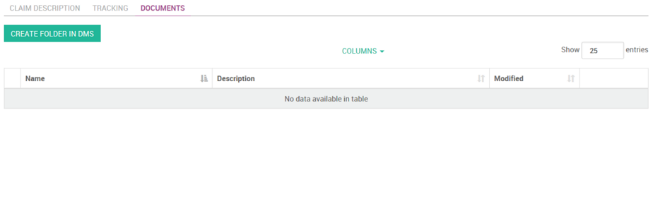

.. CMIS Viewer documentation master file.
   You can adapt this file completely to your liking, but it should at least
   contain the root `toctree` directive.

#######
Alfodoo
#######

Alfodoo is a set of `addons`_ to seamlessly integrate an external Document
Management System with `Odoo`_.

Alfodoo provides a new kind of field *CmisFolder* and its powerful widget *FieldCmisFolder*.
Alfodoo is a set of addons to display and manage content from a CMIS container linked to an Odoo model.

The Odoo widget has a modular and generic core providing functionality based
on the CMIS V1.1 protocol. This core can be extended by additional modules
in order to propose additional features or customizations proper to a specific
CMIS container. At this stage, the existing customization is for the Alfresco Document
Management System.
 
With these addons, you are now able to enrich the user's experience and
provide in Odoo great features that enable the users to easily store and
manage their documents in an external Document Management System through
a seamless integration. 

The development of Alfodoo has been founded by `ACSONE SA/NV`_.

*Learn how to* :ref:`contribute`

.. raw:: html

  

    <iframe width="560" height="315" src="https://www.youtube.com/embed/TK49kl0Viyk" frameborder="0" allowfullscreen></iframe>
  

*************
Core Features
*************

* **100% Open Source** (`AGPL version 3`_): the full `source code is available
  on GitHub`_
* Full responsive HTML Widget that enables you to view and manage content from a
  `cmis:folder`.
* ...
* See a :ref:`code-overview` with examples of code

.. _`Odoo`: http://www.odoo.com
.. _`ACSONE SA/NV`: http://www.acsone.eu
.. _`Odoo community Association (OCA)`: https://odoo-community.org/
.. _`source code is available on GitHub`: https://github.com/acsone/alfodoo
.. _`addons`: https://github.com/acsone/alfodoo
.. _`AGPL version 3`: http://www.gnu.org/licenses/agpl-3.0.html

**************************************
Overview: Manage the documents in Odoo
**************************************

Visually, the main part of the functionality is accessed through a "Documents tab" configurable on each Odoo model providing a "real-time" view on the Alfresco content.

From the user's point of view, the Documents tab gives a direct access to the items (documents lists, sub-folders, …) linked to the Odoo object and contained in the linked Alfresco folder.

The first action is to let the user create manually  (means "only when needed") the linked folder in Alfresco

Then the Documents tab shows a global menu providing the following functionality:

.. raw:: html

  <table class="table">
    <tr>
        <td> </td><td><strong>Refresh content table:</strong> This option refreshes the folder content</td>
    </tr>
    <tr>
        <td> </td><td><strong>Create folder:</strong> A (sub-)folder is created in the current folder. The user gives a name for the folder and selects "Create"</td>
    </tr>
    <tr>
        <td> </td><td><strong>Create document:</strong> Upload a document in the current folder. The user selects a file and clicks on "Create" to upload the document</td>
    </tr>
    <tr>
        <td> 

</td><td><strong>Show in Alfresco:</strong> This option opens Alfresco Share and shows the folder details page</td>
    </tr>
  </table>

In the content table, the User can see the documents and folders list.

.. image:: ./_static/img/cmis_crm_claim_new_folder.png

The following information is displayed for each item:

* An icon used to hide or unhide the item details (folder or document Alfresco metadata: cm:folder, cm:content, cm:title)
* The item name
* The item description
* Last Modified date
* A contextual menu: the options list for a folder item or for a document item 

.. image:: ./_static/img/cmis_crm_claim_doc_details.png

For a "Document" item, the following options are available:

.. raw:: html

  <table class="table">
    <tr>
        <td> </td>
        <td colspan="2"><strong>Download:</strong> Download the document</td>
    </tr>
    <tr>
        <td> </td>
        <td colspan="2"><strong>Preview:</strong> Preview the document</td>
    </tr>
    <tr>
        <td> </td>
        <td colspan="2"><strong>More actions:</strong></td>
    </tr>
    <tr>
        <td colspan="2">
        <td style="padding-left:5em"><strong>View details:</strong> this option shows some documents metadata (Alfresco cm:content).</td>
   </tr>
   <tr>
        <td colspan="2">
        <td style="padding-left:5em"><strong>Update:</strong> with this option the user can upload a new document in the folder. In case the document is associated with the Alfresco versionnable aspect Alfresco, the document version number (major) is automatically incremented.</td>
   </tr>
   <tr>
        <td colspan="2">
        <td style="padding-left:5em"><strong>Delete:</strong> delete the document.</td>
   </tr>
    <tr>
        <td> 

</td>
        <td colspan="2"><strong>Show in Alfresco:</strong> This option opens Alfresco share and shows the document details page.</td>
    </tr>
  </table>

*******
Project
*******

The Alfodoo project has the objective to provide a collection of 'addons' in order to integrate the odoo platform with a Document Management System supporting the CMIS V1.1 protocol.

Currently, the project proposes an integration between Odoo and the open-source ECM platform Alfresco.

The aim is to offer to the odoo users a transparent and easy access to the documents stored in the appropriate location in Alfresco. 

.. toctree::
   :maxdepth: 1

   project/contribute
   project/contributors
   project/license
   project/changes
   project/roadmap

*****************
Developer's guide
*****************

.. toctree::
   :maxdepth: 2

   guides/install.rst
   guides/code_overview.rst

API Reference
=============

.. toctree::
   :maxdepth: 1

   api/api_cmis_field.rst

******************
Indices and tables
******************

* :ref:`genindex`
* :ref:`modindex`
* :ref:`search`
